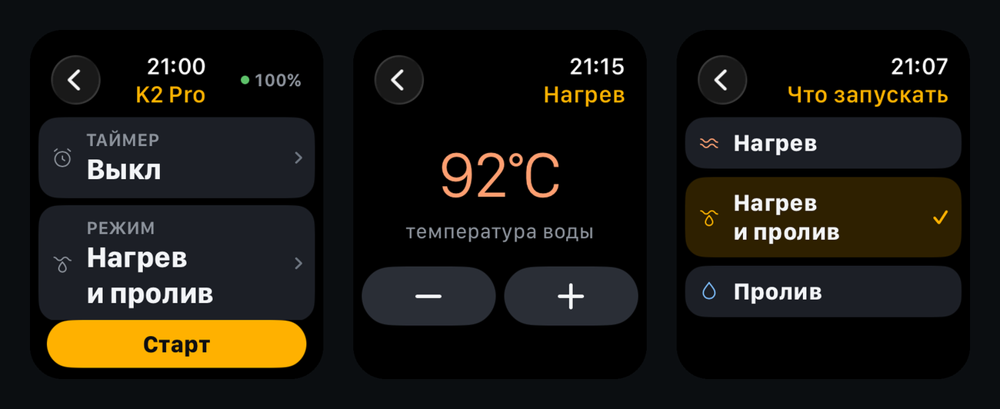
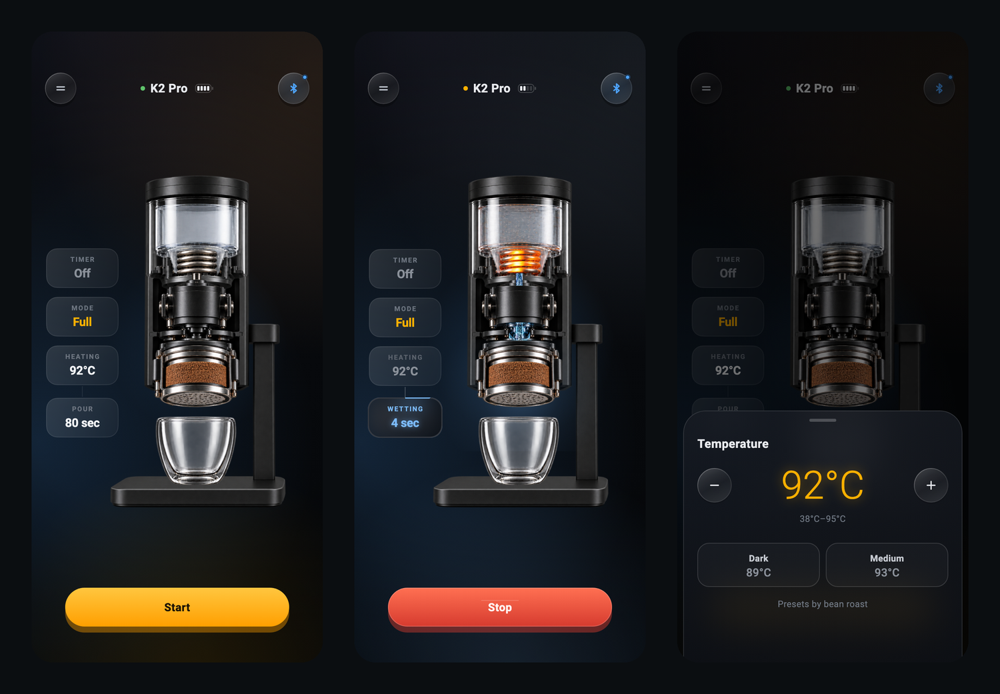

<div align="center">

# ☕ BetterCup

**Своё приложение для кофемашины Cera+ iKape K2 Pro — и приложение для Apple Watch,
с которого её можно запустить и перенастроить, не доставая телефон.**

*BetterCup — a hand-built iOS app for the Cera+ iKape K2 Pro espresso machine, plus an
Apple Watch app that starts it and tunes the recipe right from your wrist.*

[**Русский**](#русский) · [**English**](#english)

<br>



<br><br>



</div>

---

## Русский

### Зачем

Машина отличная, а управлять ею неудобно. Штатное приложение (`Happygo Cera`) знает всё
про железо и почти ничего — про то, как человек варит кофе: настройки разбросаны по
вкладкам, состояние цикла приходится угадывать, а чтобы поменять температуру на градус,
нужно пройти четыре экрана.

Здесь всё наоборот. Один экран, на нём — машина и её цикл сверху вниз: таймер, режим,
нагрев, пролив. Каждый шаг сразу и показывает своё значение, и открывается тапом. Внизу
одна кнопка, которая всегда знает, что делать дальше: подключиться, запустить, остановить,
снять будильник.

### Главное — часы

Телефон для кофе не нужен. Приложение на Apple Watch — не «пульт с одной кнопкой», а
полноценный цикл: с часов можно **выбрать режим**, **завести таймер** и **покрутить любой
параметр рецепта** — температуру, предсмачивание, паузу, экстракцию, скорость пролива.

Часы намеренно сделаны тонкой проекцией: там нет ни BLE, ни знания о протоколе, ни правил
про кофе. Телефон собирает готовый снимок состояния — числа, подписи, границы диапазонов и
даже цвета — и отправляет его через `WatchConnectivity`. Обратно едут только команды. Это
снимает целый класс рассинхронов: если машина зажала уставку по своим границам, часы
покажут именно её число, а не то, которое мы у себя нарисовали.

У снимка есть номер версии контракта: часы со старой версией честно попросят обновиться,
вместо того чтобы рисовать экран с перепутанными полями.

### Что умеет

- **Три режима** — только нагрев, нагрев с проливом, только пролив (холодная экстракция).
- **Рецепт целиком** — температура (38–95 °C), предсмачивание, пауза, время экстракции,
  скорость пролива. Пресеты по обжарке: тёмная, средне-тёмная, светлая.
- **Отложенный старт** — будильник на машине: завёл с часов, кофе к пробуждению.
- **Живой цикл** — сцена машины показывает, что происходит прямо сейчас: греется спираль,
  идёт предсмачивание, льётся в чашку. Фазы машина сама не сообщает — их считает
  `BrewPhaseEstimator` по уставкам и моменту старта, а приезжающая телеметрия его правит.
- **Ошибки по-человечески** — «нет воды», «перегрев батареи», «нужен сервис», а не код.
- **Два языка** — русский и английский, °C/°F, живое переключение.
- **Работа без машины** — `MOCK=true` поднимает симулятор кофемашины, UI можно крутить
  на любом маке.

### Как устроено

```
app/lib/
  ble/protocol.dart      кодек протокола — чистый Dart, без Flutter
  ble/transport.dart     скан / коннект / write / notify
  ble/k2_device.dart     единственный объект, который видит UI
  model/pipeline.dart    цикл как данные: шаги, границы, что редактируется
  model/brew_phase.dart  оценка фазы там, где машина молчит
  watch/watch_snapshot.dart  снимок для часов: числа, подписи, цвета
  ui/scene/              сцена машины
  ui/sheets/             настройки шагов
ios/K2ProWatch/          приложение watchOS (SwiftUI)
```

Ключевое решение — `PipelineModel`: цикл описан один раз как чистые данные, и из него
рисуется и таймлайн на телефоне, и список на часах. Правило «что входит в цикл при этом
режиме» живёт ровно в одном месте.

Запись в машину — очередь с паузой 40 мс между кадрами: `Write Without Response` без
паузы машина молча теряет.

### Протокол

BLE-протокол разобран с нуля: сервис `FFF0`, запись `FFF2` (без ответа), нотификации
`FFF1`, MTU 105. Полное описание — кадры, команды, перечисления, CRC, OTA — в
[`docs/happygo-ble-protocol.md`](docs/happygo-ble-protocol.md).

- [`docs/happygo-ux-and-client-spec.md`](docs/happygo-ux-and-client-spec.md) — разбор UX штатного приложения
- [`docs/happygo-minimal-ui.md`](docs/happygo-minimal-ui.md) — что из этого нужно на самом деле
- [`tools/happygo_ble.py`](tools/happygo_ble.py) — эталонная реализация кодека, `python3 tools/happygo_ble.py` прогоняет self-check

### Сборка

```bash
cd app

# с симулятором машины — железо не нужно
flutter run -d macos --dart-define=MOCK=true

# с настоящей машиной
flutter run -d <iphone>

# тесты (62) и перерисовка скриншотов (17 сцен)
flutter test
flutter test tool/screenshots --update-goldens
```

Часы собираются вместе с iOS-таргетом: `K2ProWatch.app` встраивается в `Runner.app`.

### Про машину

Cera+ iKape KAPO K2 Pro — портативная эспрессо-машина: 58 мм бездонный холдер, помпа до
20 бар, встроенный нагрев (60 мл до 93 °C за три минуты), батарея 13500 мА·ч.

- [Официальный магазин IKAPE](https://ikapestore.com/products/ikape-portable-coffee-maker-58mm-basket-kapo-k2-pro)
- [Amazon](https://us.amazon.com/IKAPE-Portable-Espresso-Bottomless-Electric/dp/B0G37P9VB5)
- [Обзор Barista Magazine](https://www.baristamagazine.com/test-drive-ikape-kapo-k2-pro/)

> Проект неофициальный и с производителем никак не связан. Протокол восстановлен
> реверс-инжинирингом штатного приложения ради совместимости.

---

## English

### Why

The machine is great; controlling it is not. The stock app (`Happygo Cera`) knows
everything about the hardware and almost nothing about how a person actually brews:
settings scattered across tabs, cycle state you have to guess at, and four screens to
move the temperature by one degree.

This app inverts that. One screen, with the machine and its cycle laid out top to bottom:
timer, mode, heat, pour. Every step shows its value and opens on tap. One button at the
bottom that always knows what comes next — connect, start, stop, cancel the alarm.

### The watch is the point

You shouldn't need your phone to make coffee. The Apple Watch app isn't a one-button
remote — it's the whole cycle: **pick the mode**, **arm the timer**, and **dial in any
recipe parameter** — temperature, pre-infusion, standstill, extraction, pour speed.

The watch is deliberately a thin projection. It has no BLE, no knowledge of the protocol,
and no coffee rules. The phone builds a complete state snapshot — numbers, labels, range
limits, even colors — and ships it over `WatchConnectivity`. Only commands travel back.
That kills a whole class of desync bugs: if the machine clamps a setpoint to its own
limits, the watch shows *that* number, not the one we drew locally.

The snapshot carries a contract version, so an outdated watch asks to be updated instead
of rendering a screen with shuffled fields.

### What it does

- **Three modes** — heat only, heat + brew, brew only (cold extraction).
- **The full recipe** — temperature (38–95 °C), pre-infusion, standstill, extraction time,
  pour speed. Presets by roast: dark, medium-dark, light.
- **Scheduled start** — arm the machine's alarm from your wrist, wake up to coffee.
- **A live cycle** — the machine scene shows what's happening right now: coil glowing,
  pre-infusion soaking, espresso pouring. The machine doesn't report phases, so
  `BrewPhaseEstimator` derives them from the setpoints and start time, and incoming
  telemetry corrects it.
- **Errors in plain language** — "no water", "battery overheating", "service needed",
  not a numeric code.
- **Two languages** — English and Russian, °C/°F, switchable live.
- **Runs without hardware** — `MOCK=true` boots a simulated machine on any Mac.

### How it's built

```
app/lib/
  ble/protocol.dart      protocol codec — pure Dart, no Flutter
  ble/transport.dart     scan / connect / write / notify
  ble/k2_device.dart     the single object the UI ever sees
  model/pipeline.dart    the cycle as data: steps, limits, what's editable
  model/brew_phase.dart  phase estimation where the machine stays silent
  watch/watch_snapshot.dart  the watch snapshot: numbers, labels, colors
  ui/scene/              the machine scene
  ui/sheets/             per-step editors
ios/K2ProWatch/          watchOS app (SwiftUI)
```

The key decision is `PipelineModel`: the cycle is described once as pure data, and both
the phone timeline and the watch list render from it. The rule for "what belongs in the
cycle in this mode" lives in exactly one place.

Writes go through a queue with a 40 ms gap between frames — without it the machine
silently drops `Write Without Response` packets.

### Protocol

The BLE protocol was reverse-engineered from scratch: service `FFF0`, write `FFF2`
(no response), notify `FFF1`, MTU 105. Full write-up — framing, commands, enums, CRC,
OTA — in [`docs/happygo-ble-protocol.md`](docs/happygo-ble-protocol.md).

- [`docs/happygo-ux-and-client-spec.md`](docs/happygo-ux-and-client-spec.md) — teardown of the stock app's UX
- [`docs/happygo-minimal-ui.md`](docs/happygo-minimal-ui.md) — what's actually worth keeping
- [`tools/happygo_ble.py`](tools/happygo_ble.py) — reference codec; `python3 tools/happygo_ble.py` runs a self-check

### Build

```bash
cd app

# with the simulated machine — no hardware needed
flutter run -d macos --dart-define=MOCK=true

# with the real machine
flutter run -d <iphone>

# tests (62) and screenshot regeneration (17 scenes)
flutter test
flutter test tool/screenshots --update-goldens
```

The watch app builds with the iOS target: `K2ProWatch.app` is embedded into `Runner.app`.

### The machine

The Cera+ iKape KAPO K2 Pro is a portable espresso machine: 58 mm bottomless basket,
pump up to 20 bar, built-in heating (60 ml to 93 °C in three minutes), 13500 mAh battery.

- [Official IKAPE store](https://ikapestore.com/products/ikape-portable-coffee-maker-58mm-basket-kapo-k2-pro)
- [Amazon](https://us.amazon.com/IKAPE-Portable-Espresso-Bottomless-Electric/dp/B0G37P9VB5)
- [Barista Magazine review](https://www.baristamagazine.com/test-drive-ikape-kapo-k2-pro/)

> Unofficial project, not affiliated with the manufacturer. The protocol was recovered by
> reverse-engineering the stock app for interoperability.

---

<div align="center">
<sub>Flutter · SwiftUI · watchOS · Bluetooth Low Energy</sub>
</div>
